<p align="center"></p>

# Mockify

**A flight simulator for interviews.** Know your own work before someone asks you about it.

A student uploads a resume and picks the role they want. Mockify reads the resume like an interviewer would, assembles three expert interviewers chosen from the resume's gaps, and questions the student by voice or text. A coach helps without giving answers, every resume line turns green, yellow or red as it is tested, and the session ends in a coaching verdict, never a rejection.

Built for the prHACKtical hackathon, digital learning track, on top of the Shadow Committee engine.

---

## Why

Students rarely fail interviews because of nerves alone. They fail because they can't explain or defend their own work under questioning. Existing tools coach delivery (eye contact, filler words); generic chatbots are one voice that hands over polished answers. Students without someone at home to practice with, such as first-generation, online and career-changing students, feel this most.

Mockify coaches **what students know**, not just how they speak.

## The experience

| Step | What happens |
|---|---|
| **1. Upload and target** | Resume PDF (or pasted text), a target role, level, and optionally a real job posting. |
| **2. Resume Audit** | The resume is split into individual claims. Strengths, lines that need the "how", and shaky claims light up as a scan passes over them. Skills the role expects but the resume never mentions are listed. |
| **3. Panel arrival** | Three interviewers chosen from 11 domains (Frontend, Backend, DevOps, UI/UX, Data/ML, Data & Analytics, System Design, QA, Mobile, Security, Hiring Manager). Each says, in their own voice, why they joined: *"Your resume mentions AWS but never explains how the site actually goes live."* |
| **4. The interview** | Whoever has the biggest unresolved doubt asks next. Interviewers build on each other. After every answer the confidence ring moves, the face changes, a floating +12 or −8 appears, and the resume lines being tested change color on the live **Defensibility Map**. |
| **5. Peek behind the panel** | Click any interviewer to see what they were looking for, what your last answer showed and missed, and which doubts are still open. |
| **6. Lifeline** | One per interview. Sam the coach gives a hint, never the answer, and the student tries again. |
| **7. Panel huddle** | The panel slides together and confers out loud before the verdict. |
| **8. Verdict** | *Interview Ready* (70%+), *Almost There* (40–69%) or *Keep Practicing*. Full Defensibility Map, per-interviewer takeaways, three things to practice this week, three 60-second drills. |
| **9. Take-aways** | Highlight Reel of the three answers that moved the panel most (with your recorded voice), a Coaching Report PDF, a shareable Wrapped card, and a readiness journey across sessions. |
| **10. The Comeback** | Rematch only the interviewer who still has doubts. |

## What makes the engine trustworthy

- **The server owns the score.** The model chooses a reaction band (impressed, neutral, probing, skeptical) and a strength; the server maps that to the confidence change. Faces, rings and numbers always agree.
- **Evidence is verified.** Every judgment quotes the student's own words. The server checks the quote really appears in the answer; if the model paraphrased, it substitutes the closest real sentence and drops the "your words" badge.
- **Hints, not answers.** The coach is constrained to structure and guiding questions, following research that answer-giving AI tutors harm learning (Bastani et al., PNAS 2025).
- **Judged on substance.** Prompts instruct every interviewer to ignore grammar, accent and transcription errors.
- **Explainable turn order.** `priority = 0.5·(100 − confidence) + 8·open doubts + 10·questions left + 15 if they haven't spoken − 25 if they just spoke`. Everyone is heard before anyone asks twice.
- **Real follow-ups.** A partial answer can earn one "go deeper" question from the same interviewer.

## Architecture

The browser is a thin client. Every decision (who asks next, how many points an answer earns, which resume lines change color) is made by a session engine on the server and saved after each step.

### The big picture

```mermaid
%%{init: {"theme": "base", "themeVariables": {"primaryColor": "#1c2147", "primaryTextColor": "#f4f5ff", "primaryBorderColor": "#5b63a8", "lineColor": "#9aa2d8", "textColor": "#e6e8ff", "clusterBkg": "#0b0e1f", "clusterBorder": "#3a4185", "titleColor": "#f4f5ff", "edgeLabelBackground": "#0b0e1f"}, "flowchart": {"curve": "basis", "padding": 16, "nodeSpacing": 26, "rankSpacing": 54}}}%%
flowchart TB
  student(["🎓 <b>Student</b><br/>resume · role<br/>voice or text"])

  subgraph PP[" "]
    direction TB

    subgraph CLIENT["🖥️#nbsp; BROWSER · Next.js 16 · React 19"]
      direction TB
      screens["<b>8 screens</b><br/>audit · panel · interview<br/>huddle · verdict<br/>reel · Wrapped"]
      store["<b>store.ts</b><br/>Zustand state machine<br/>shows what the server<br/>decided"]
      voice["<b>voice.ts · use-recorder</b><br/>live captions · waveform<br/>browser voice fallback"]
      device["<b>Stays on the device</b><br/>answer recordings<br/>PDF report · Wrapped PNG"]
    end

    subgraph API["⚡#nbsp; NEXT.JS ROUTE HANDLERS"]
      direction TB
      sessions["<b>/api/sessions</b><br/>create · history · delete"]
      loop["<b>/api/sessions/:id/…</b><br/>panel · turn · answer<br/>lifeline · next<br/>finish · rematch"]
      media["<b>/api/tts · /api/transcribe</b><br/>voices out · speech in<br/>voice lines cached on disk"]
    end

    subgraph ENGINE["🧠#nbsp; SESSION ENGINE · the server owns every decision"]
      direction LR
      redact["<b>resume-text.ts</b><br/>PDF to text,<br/>PII stripped first"]
      engine["<b>engine.ts</b><br/>audit · panel · turns<br/>lifeline · verdict · rematch"]
      scoring["<b>scoring.ts</b><br/>band → points<br/>evidence check<br/>who asks next · stats"]
      prompts["<b>prompts.ts</b><br/>six roles, one rulebook"]
      llm{{"<b>llm.ts</b><br/>demo or live?<br/>fast or deep?<br/>JSON repair · retry"}}
      redact --> engine
      engine <--> scoring
      engine --> prompts --> llm
    end

    subgraph STORAGE["💾#nbsp; STORAGE"]
      direction TB
      db[("<b>SQLite · libSQL</b><br/>one SessionDoc<br/>per session")]
      maya[("<b>Maya's script</b><br/>recorded model<br/>output")]
    end

    subgraph CREATEAI["☁️#nbsp; ASU CreateAI · POST /query"]
      direction TB
      fast["<b>Fast tier</b><br/>project model · ~3 s<br/>audit · questions<br/>scoring · hints"]
      deep["<b>Deep tier</b><br/>gpt-4o<br/>panel builder<br/>huddle · verdict"]
      speech["<b>Speech</b><br/>tts-1<br/>six voices"]
      whisper["<b>Audio</b><br/>whisper-1<br/>speech to text"]
    end
  end

  student ==> screens
  store ==>|"JSON · NDJSON stream"| loop
  store --> sessions
  voice -->|"audio"| media
  sessions --> ENGINE
  loop ==> ENGINE
  ENGINE ==>|"saved after every step"| db
  ENGINE -.->|"demo mode"| maya
  ENGINE ==>|"live mode"| CREATEAI
  media -->|"new lines only"| speech
  media --> whisper

  classDef person fill:#FFC627,stroke:#FFE08A,stroke-width:2px,color:#1a1300
  classDef client fill:#1d1a45,stroke:#A78BFA,stroke-width:1.5px,color:#f1edff
  classDef api fill:#0d2a31,stroke:#2DD4BF,stroke-width:1.5px,color:#e8fffb
  classDef core fill:#29230f,stroke:#FFC627,stroke-width:1.5px,color:#fff8e1
  classDef hub fill:#4a3c0a,stroke:#FFC627,stroke-width:2.5px,color:#fff8e1
  classDef data fill:#2c1a0f,stroke:#FB923C,stroke-width:1.5px,color:#fff1e6
  classDef ai fill:#8C1D40,stroke:#FFC627,stroke-width:1.5px,color:#ffffff
  class student person
  class screens,store,voice,device client
  class sessions,loop,media api
  class redact,engine,scoring,prompts core
  class llm hub
  class db,maya data
  class fast,deep,speech,whisper ai

  style PP fill:#0b0e1f,stroke:#2a2f5e,stroke-width:1px
  style CLIENT fill:#121433,stroke:#A78BFA,stroke-width:2px,color:#C4B5FD
  style API fill:#0b1e26,stroke:#2DD4BF,stroke-width:2px,color:#5EEAD4
  style ENGINE fill:#1a170c,stroke:#FFC627,stroke-width:2px,color:#FFD95A
  style STORAGE fill:#1e140d,stroke:#FB923C,stroke-width:2px,color:#FDBA74
  style CREATEAI fill:#3a0d1d,stroke:#FFC627,stroke-width:2px,color:#FFD95A
  style device stroke-dasharray:5 4
```

<!-- diagram: 01-architecture -->


### One session, from resume to verdict

```mermaid
%%{init: {"theme": "base", "themeVariables": {"primaryColor": "#1c2147", "primaryTextColor": "#f4f5ff", "primaryBorderColor": "#5b63a8", "lineColor": "#9aa2d8", "textColor": "#e6e8ff", "clusterBkg": "#0b0e1f", "clusterBorder": "#3a4185", "titleColor": "#f4f5ff", "edgeLabelBackground": "#0b0e1f"}, "flowchart": {"curve": "basis", "padding": 16, "nodeSpacing": 30, "rankSpacing": 50}}}%%
flowchart TB
  subgraph PP[" "]
    direction TB

    subgraph BEFORE["① PREPARE · resume to panel"]
      direction LR
      home(["🏠 <b>Home</b><br/>resume + target role"])
      audit["🔍 <b>Resume Audit</b><br/>every claim flagged<br/>strong · needs the how<br/>or shaky"]
      panel["👥 <b>Panel arrives</b><br/>3 of 11 domain experts,<br/>each says why they joined"]
      home -->|"POST /sessions<br/>redact, then audit"| audit
      audit -->|"POST /panel<br/>gpt-4o"| panel
    end

    subgraph ROOM["② INTERVIEW ROOM · up to 6 questions"]
      direction LR
      ask["❓ <b>Question</b><br/>the biggest doubt<br/>asks next"]
      react["📈 <b>Panel reacts</b><br/>ring · face · ±points<br/>map lines change color"]
      choice{"weak<br/>first try?"}
      hint["💡 <b>Lifeline</b><br/>Sam gives a hint,<br/>never the answer"]
      ask -->|"POST /answer"| react
      react --> choice
      choice -->|"yes · POST /lifeline"| hint
      hint -->|"second try"| react
      choice -.->|"no · next question<br/>already streamed in"| ask
    end

    subgraph AFTER["③ DEBRIEF · never a rejection"]
      direction LR
      huddle["🤝 <b>Huddle</b><br/>the panel confers<br/>out loud"]
      verdict["🏆 <b>Verdict</b><br/>Interview Ready<br/>Almost There<br/>Keep Practicing"]
      takeaways["🎬 <b>Take-aways</b><br/>Highlight Reel · Wrapped<br/>Coaching Report PDF<br/>readiness journey"]
      rematch["🔁 <b>Rematch</b><br/>face only the interviewer<br/>who still has doubts"]
      huddle --> verdict --> takeaways
      takeaways -.->|"POST /rematch"| rematch
    end

    BEFORE ==>|"POST /turn"| ROOM
    ROOM ==>|"POST /finish · prefetched<br/>while the last reaction plays"| AFTER
  end

  classDef step fill:#1c2147,stroke:#7c84c8,stroke-width:1.5px,color:#f4f5ff
  classDef start fill:#FFC627,stroke:#FFE08A,stroke-width:2px,color:#1a1300
  classDef live fill:#0d2a31,stroke:#2DD4BF,stroke-width:1.5px,color:#e8fffb
  classDef coach fill:#4a3c0a,stroke:#FFC627,stroke-width:2px,color:#FFE08A
  classDef finale fill:#8C1D40,stroke:#FFC627,stroke-width:2px,color:#ffffff
  class home start
  class audit,panel,huddle,takeaways,rematch step
  class ask,react,choice live
  class hint coach
  class verdict finale

  style PP fill:#0b0e1f,stroke:#2a2f5e,stroke-width:1px
  style BEFORE fill:#121433,stroke:#A78BFA,stroke-width:2px,color:#C4B5FD
  style ROOM fill:#0b1e26,stroke:#2DD4BF,stroke-width:2px,color:#5EEAD4
  style AFTER fill:#3a0d1d,stroke:#FFC627,stroke-width:2px,color:#FFD95A
```

<!-- diagram: 02-session-journey -->


### One answer, in about three seconds

What happens between the student finishing an answer and the panel reacting, using Maya's first answer from the demo.

```mermaid
%%{init: {"theme": "base", "themeVariables": {"actorBkg": "#1c2147", "actorBorder": "#7c84c8", "actorTextColor": "#f4f5ff", "actorLineColor": "#5b63a8", "signalColor": "#c9cdf2", "signalTextColor": "#f4f5ff", "labelBoxBkgColor": "#FFC627", "labelBoxBorderColor": "#FFC627", "labelTextColor": "#1a1300", "loopTextColor": "#FFD95A", "noteBkgColor": "#FFC627", "noteBorderColor": "#FFE08A", "noteTextColor": "#1a1300", "activationBkgColor": "#2DD4BF", "activationBorderColor": "#5EEAD4", "sequenceNumberColor": "#0b0e1f"}, "sequence": {"mirrorActors": false, "messageAlign": "left", "boxMargin": 12, "noteMargin": 12}}}%%
sequenceDiagram
  autonumber
  participant S as 🎓 Student
  participant B as 🖥️ Browser
  participant R as ⚡ API routes
  participant E as 🧠 Engine
  participant AI as ☁️ CreateAI
  participant DB as 💾 SQLite

  rect rgb(11, 14, 31)
    S->>B: Speaks the answer
    B->>R: POST /api/transcribe (WebM audio)
    R->>AI: whisper-1
    AI-->>B: transcript
    B->>R: POST /api/sessions/:id/answer
    R->>E: lock the session, submitAnswer()
    activate E
    E->>DB: load SessionDoc
    E->>AI: Evaluator prompt, fast tier
    AI-->>E: band "skeptical", strength 2, quote, line IDs

    rect rgb(42, 35, 12)
      Note over E: The server owns the verdict
      E->>E: band + strength → −8 from a fixed table
      E->>E: quote really in her answer? if not, use her closest sentence
      E->>E: skeptical → red · impressed → green
    end

    E->>DB: save SessionDoc
    E-->>R: result
    deactivate E
    R-->>B: stream line 1 · result
    B-->>S: ring drops, face changes, −8 floats up, AWS lines turn red

    alt weak first try and the Lifeline is unused
      R-->>B: stream line 2 · decision
      B-->>S: Use the Lifeline or move on?
    else the interview continues
      R->>E: startTurn() plans who asks next
      E->>AI: Interviewer prompt
      AI-->>E: next question
      R-->>B: stream line 2 · next
      B->>R: POST /api/tts (prefetched while the reaction plays)
    else that was the last question
      R-->>B: stream line 2 · end
      B->>R: POST /finish in the background, verdict ready before the huddle
    end
  end
```

<!-- diagram: 03-answer-sequence -->


### Why it's built this way

The full system design (deployment, data model, session states, AI gateway, latency budget, failure modes, privacy and scaling) is in [docs/SYSTEM_DESIGN.md](docs/SYSTEM_DESIGN.md).

- **Server-authoritative sessions.** Every decision lives in the session engine and is persisted after each step, so a refresh mid-interview resumes exactly where it was (`?s=<session id>`).
- **Streaming answers.** The answer endpoint streams the evaluation first so the panel reacts instantly, then the next question while the reaction animation plays.
- **One AI integration.** All model calls go through `lib/server/llm.ts`, which uses CreateAI when `CREATEAI_API_KEY` is set (Groq is a dev-only fallback).
- **Record and replay demo.** Demo mode replays scripted model outputs through the *real* engine, so the demo exercises the same scoring, evidence checks and turn selection as live mode. Set `RECORD_FIXTURES=1` during a live session to capture a new script.

## Running it

```bash
npm install
npm run dev            # http://localhost:3000
```

**Demo mode needs no keys.** Click *Watch Maya's session* on the home screen. Maya is a fictional first-generation sophomore applying for a frontend internship. Each question has a *Play Maya's answer* button so the presenter controls the pace.

**Live mode** needs an ASU CreateAI project service token:

```bash
cp .env.example .env.local     # then set CREATEAI_API_KEY
npm run check:createai         # verifies the token, model name and response shapes
npm run dev
```

Model routing: interview-loop calls (resume audit, questions, scoring, coach hints) use `CREATEAI_FAST_MODEL_NAME` (default: the CreateAI project's own model, about 3 s per call). Panel building and the verdict use `CREATEAI_MODEL_NAME` (default `gpt4o`); they run behind the audit screen and in the background while the last answer's feedback plays. With a token, interviewer voices use CreateAI Speech and spoken answers are transcribed by CreateAI Whisper. Without one, the app falls back to the browser's voices and speech recognition.

CreateAI notes, verified with a project service token: system prompts only apply when `request_source` is `"override_params"`; speech returns base64 MP3 in `response`; transcription needs `action: "query"` and `query: "transcribe this"` alongside the base64 `audio_file`. Every call sets `enable_history` and `enable_search` to false so a project's own chat history or knowledge base can't leak into an interview.

**Before demo day:**

```bash
npm run warm:demo      # with the app running: pre-generates every voice line of Maya's demo into data/tts-cache
```

After this, the demo plays real CreateAI voices instantly and keeps working if the venue Wi-Fi drops (cached audio is served from disk; without audio the app falls back to browser voices).

**Rate limits:** CreateAI projects have a tokens-per-minute limit. A full live session (audit, panel, about six questions with scoring, verdict and voices) is roughly tens of thousands of tokens, so back-to-back live sessions can hit the limit. The app retries once and then shows a friendly "give it a minute" message; voices fall back to the browser. For the event, consider a dedicated CreateAI project for Mockify or a temporary limit increase, and use demo mode for the scripted pitch.

**Deploying to Vercel:** set `DATABASE_URL` / `DATABASE_AUTH_TOKEN` to a hosted libSQL database (for example Turso). Vercel's filesystem doesn't persist the local SQLite file.

## Demo script (about 3 minutes)

1. *Watch Maya's session* → the Resume Audit flags "Deployed the portfolio on AWS" as *needs the how*.
2. Meet the panel: Priya (Frontend Lead), Leo (QA), Marcus (DevOps). Marcus joins because the resume "never explains how the site actually goes live."
3. Marcus asks first (biggest doubt). Play Maya's vague answer → skeptical, −8, the AWS line turns red.
4. Use the Lifeline → Sam gives a three-stops hint → play the second try → impressed, +16, lines turn green.
5. Leo builds on Marcus's question → partial answer, probing, Jest turns yellow.
6. Priya asks about React Context → impressed, +12.
7. Huddle → *Almost There, 53%* → Highlight Reel → Wrapped: "You defended 6 of 7 lines your panel tested."

## Responsible AI and privacy

- Emails, phone numbers, links and street addresses are removed before any AI call.
- Only resume text and session results are stored, in the app's own database. No student IDs or grades.
- Students can delete a session or their whole history from the verdict and journey screens.
- Verdicts are practice signals for the student alone, never hiring decisions and never shared with employers.
- No hostile language, no "rejected", no negative sounds. Realistic pressure, supportive outcome.
- Hackathon demos use the fictional sample resume only.

## Project structure

```
app/
  page.tsx                 screen router (home → audit → assemble → interview → huddle → verdict → reel → wrapped)
  api/                     session engine endpoints, tts, transcribe, config
components/pp/
  screens/                 one file per screen
  stage.tsx                boardroom stage geometry, seats, name plates
  bubble.tsx               question bubble with live captions and evidence
  resume-map.tsx           Defensibility Map
  answer-dock.tsx          voice/text input, Lifeline, demo playback
  peek.tsx, coach.tsx, journey.tsx, top-bar.tsx, primitives.tsx
lib/
  server/engine.ts         session lifecycle: audit, panel, turns, evaluation, lifeline, verdict, rematch
  server/scoring.ts        band → score mapping, evidence verification, turn selection, stats
  server/prompts.ts        Resume Audit, Panel Builder, Interviewer, Evaluator, Coach, Huddle prompts
  server/createai.ts       ASU CreateAI client (query, speech, audio)
  server/demo/maya.ts      demo script (raw model outputs) and sample history
  store.ts                 client state machine (Zustand)
  voice.ts, sfx.ts         character voices and synthesized sound cues
  report-pdf.ts            Coaching Report PDF
scripts/check-createai.mjs CreateAI connectivity check
```

## Roadmap

1. Student pilot before real internship interviews.
2. Panels for non-technical roles (nursing, business, research positions).
3. Topic understanding: load a course topic instead of a resume and defend what you learned.
4. Project Defense in courses, making student reasoning visible in the age of AI.
5. Advisor view, with student permission.
