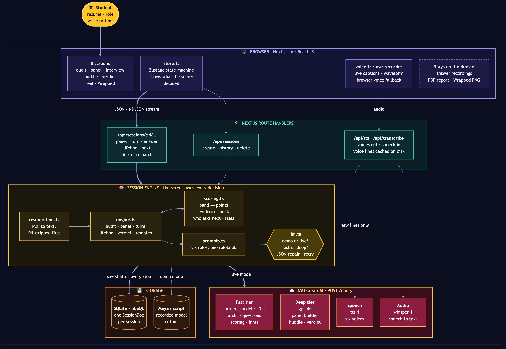

# Mockify: System Design

Mockify is a mock interview panel for students. A Next.js server runs a session engine that owns every decision in an interview: who asks next, how many points an answer earns, which resume lines turn green, yellow or red. ASU CreateAI supplies the language, the voices and the transcription, but never the score. This document explains how the pieces fit, why they were built this way, and what would change for a real student pilot.

| | |
|---|---|
| **Client** | Next.js 16 (App Router), React 19, Tailwind 4, Framer Motion, Zustand |
| **Server** | Next.js route handlers on Node.js, TypeScript end to end |
| **AI** | ASU CreateAI: Query (two model tiers), Speech (tts-1), Audio (whisper-1) |
| **Storage** | SQLite through Drizzle and libSQL; Turso when hosted |
| **Modes** | **Live** (real resume, real models) and **Demo** (Maya's scripted session replayed through the real engine) |



The diagram above, the session journey and the life of one answer are drawn in the [README](../README.md#architecture). This document adds the deployment view, the data model, the session states, the AI gateway and the latency budget.

---

## 1. What the system has to do

| Requirement | How the design meets it |
|---|---|
| Turn a resume into a targeted interview | Resume Audit splits the resume into claims (`L1…Ln`) and flags strengths, gaps and shaky lines; the Panel Builder picks 3 of 11 domain experts from those gaps. |
| Feel like a live conversation | Answers are evaluated in about 3 to 4 seconds on the fast model tier; the next question and its voice are prepared while the panel's reaction plays. |
| Be fair and explainable | The model picks a reaction band; the server maps it to points from a fixed table. Every judgment quotes the student's own words, and the server checks the quote is real. |
| Coach, not hand over answers | One Lifeline per interview: a hint built from the student's own resume and words, never a model answer. |
| Protect students | Contact details are stripped before any AI call. Voice recordings never leave the laptop. Sessions can be deleted. |
| Survive a live demo | Demo mode needs no keys or network AI, voices are pre-recorded and committed, and every failure has a fallback (section 9). |
| Stay within ASU governance | Only ASU CreateAI is used in production paths; the service token lives on the server; project history and knowledge-base search are switched off per call. |

## 2. Architecture

The system has five layers. Each one has a single job.

| Layer | Job | Key files |
|---|---|---|
| **Browser** | Draws whatever state the server returns; records audio; plays voices; builds the PDF and PNG exports locally. | `lib/store.ts`, `lib/voice.ts`, `hooks/use-recorder.ts`, `components/pp/*` |
| **Route handlers** | Validate input, take a per-session lock, call the engine, map errors to friendly HTTP responses, stream answers as NDJSON. | `app/api/**/route.ts`, `lib/server/http.ts` |
| **Session engine** | The rules of an interview: audit, panel, turns, scoring, evidence checks, Lifeline, verdict, rematch. Saves after every step. | `lib/server/engine.ts`, `scoring.ts`, `prompts.ts` |
| **AI gateway** | One function, `callJSON`, for every model call: demo replay or live, fast or deep model, JSON repair, retries, rate-limit handling. | `lib/server/llm.ts`, `lib/server/createai.ts` |
| **Storage** | One row per session holding the whole session document, plus voice caches and the demo script. | `lib/server/db.ts`, `repo.ts`, `assets/demo-voices/` |

**The server is the source of truth.** The browser never computes a score or decides who speaks. That keeps the faces, rings, numbers and map colors consistent with each other, lets a refresh resume mid-interview (`?s=<session id>`), and makes history, rematches and the readiness journey possible.

## 3. Deployment

```mermaid
%%{init: {"theme": "base", "themeVariables": {"primaryColor": "#1c2147", "primaryTextColor": "#f4f5ff", "primaryBorderColor": "#5b63a8", "lineColor": "#9aa2d8", "textColor": "#e6e8ff", "clusterBkg": "#0b0e1f", "clusterBorder": "#3a4185", "titleColor": "#f4f5ff", "edgeLabelBackground": "#0b0e1f"}, "flowchart": {"curve": "basis", "padding": 16, "nodeSpacing": 26, "rankSpacing": 70}}}%%
flowchart LR
  subgraph PP[" "]
    direction LR

    subgraph LAPTOP["💻#nbsp; STUDENT'S LAPTOP · any modern browser"]
      direction LR
      app["<b>Mockify web app</b><br/>React 19 · Zustand<br/>Framer Motion"]
      mic["<b>Microphone</b><br/>MediaRecorder<br/>WebM / Opus"]
      fallback["<b>Browser fallbacks</b><br/>speechSynthesis<br/>SpeechRecognition"]
      keep["<b>Never uploaded</b><br/>answer recordings<br/>PDF · PNG · preferences"]
    end

    subgraph SERVER["🖥️#nbsp; MOCKIFY SERVER · Node.js"]
      direction LR
      routes["<b>Route handlers</b><br/>JSON · NDJSON stream<br/>multipart uploads"]
      eng["<b>Session engine</b><br/>one lock per session"]
      secrets["<b>Server-only secrets</b><br/>CREATEAI_API_KEY<br/>DATABASE_URL"]
      disk["<b>Disk</b><br/>voice cache<br/>committed demo voices"]
    end

    subgraph DATA["💾#nbsp; DATABASE"]
      direction LR
      sqlite[("<b>libSQL</b><br/>local file data/panelprep.db<br/>or Turso when hosted")]
    end

    subgraph ASU["☁️#nbsp; ASU CreateAI"]
      direction LR
      query["<b>POST /query</b><br/>api-main.aiml.asu.edu<br/>text · speech · audio"]
    end
  end

  LAPTOP ==>|"HTTPS · JSON, NDJSON stream,<br/>resume PDF, answer audio"| SERVER
  SERVER ==>|"SQL"| DATA
  SERVER ==>|"HTTPS · Bearer service token"| ASU

  classDef client fill:#1d1a45,stroke:#A78BFA,stroke-width:1.5px,color:#f1edff
  classDef api fill:#0d2a31,stroke:#2DD4BF,stroke-width:1.5px,color:#e8fffb
  classDef data fill:#2c1a0f,stroke:#FB923C,stroke-width:1.5px,color:#fff1e6
  classDef ai fill:#8C1D40,stroke:#FFC627,stroke-width:1.5px,color:#ffffff
  class app,mic,fallback,keep client
  class routes,eng,secrets,disk api
  class sqlite data
  class query ai

  style PP fill:#0b0e1f,stroke:#2a2f5e,stroke-width:1px
  style LAPTOP fill:#121433,stroke:#A78BFA,stroke-width:2px,color:#C4B5FD
  style SERVER fill:#0b1e26,stroke:#2DD4BF,stroke-width:2px,color:#5EEAD4
  style DATA fill:#1e140d,stroke:#FB923C,stroke-width:2px,color:#FDBA74
  style ASU fill:#3a0d1d,stroke:#FFC627,stroke-width:2px,color:#FFD95A
  style keep stroke-dasharray:5 4
  style secrets stroke-dasharray:5 4
```

<!-- diagram: 04-deployment -->


- **Local / event laptop:** `npm run dev` or `next start`. The database is a file in `data/`.
- **Hosted (Vercel):** route handlers run as functions (`maxDuration` 30 to 60 s; the answer stream fits inside one invocation). Set `DATABASE_URL` and `DATABASE_AUTH_TOKEN` to a Turso database, because function disks don't persist. The committed demo voices ship with the build.
- **No AI keys ever reach the browser.** The browser only talks to Mockify's own routes.

| Variable | Purpose |
|---|---|
| `CREATEAI_API_KEY` | CreateAI project service token (live mode, voices, transcription) |
| `CREATEAI_FAST_MODEL_NAME` | Interview-loop model; defaults to the CreateAI project's own model |
| `CREATEAI_MODEL_NAME` | Panel and verdict model; defaults to `gpt4o` |
| `DATABASE_URL`, `DATABASE_AUTH_TOKEN` | Hosted libSQL (Turso); omit to use the local file |
| `RECORD_FIXTURES=1` | Capture a live session's model outputs as a new demo script |

## 4. Data model

A session is one JSON document. The database keeps it in a single row, with a few summary columns so the history list doesn't have to parse every document.

```mermaid
%%{init: {"theme": "base", "themeVariables": {"primaryColor": "#1c2147", "primaryTextColor": "#f4f5ff", "primaryBorderColor": "#5b63a8", "lineColor": "#9aa2d8", "textColor": "#e6e8ff", "clusterBkg": "#0b0e1f", "clusterBorder": "#3a4185", "titleColor": "#f4f5ff", "edgeLabelBackground": "#0b0e1f"}, "flowchart": {"curve": "basis", "padding": 16, "nodeSpacing": 24, "rankSpacing": 56}}}%%
flowchart LR
  subgraph PP[" "]
    direction LR
    row[("<b>sessions table</b><br/>id · status · kind · mode<br/>created_at · updated_at<br/>role_title · verdict<br/>overall<br/><b>doc</b>: the whole<br/>SessionDoc as JSON")]
    session["<b>SessionDoc</b><br/>id · parentId · status<br/>kind: full or rematch<br/>mode: live or demo<br/>setup: role · level · posting<br/>config: question limits<br/>lifeline: used, which turn"]
    resume["<b>resume</b><br/>headline<br/>missing skills"]
    line["<b>ResumeLine</b> · L1 to Ln<br/>section · text<br/>flag: strength, gap, shaky<br/>status: untested, then<br/>green, yellow or red<br/>testedBy · evidence"]
    person["<b>Interviewer</b> · i0 to i2<br/>seat · domain · name<br/>title · voice · persona<br/>confidence: start → now<br/>history · reaction"]
    concern["<b>Concern</b><br/>text · lineIds<br/>state: open, probed,<br/>resolved<br/>origin: audit or answer"]
    turn["<b>Turn</b><br/>interviewerId · concernId<br/>question · hint<br/>kind: question or follow-up"]
    attempt["<b>Attempt</b><br/>answer text<br/>hint used · time"]
    result["<b>EvalResult</b><br/>reaction · strength<br/>scoreDelta · lineIds<br/>lineStatus · feedback<br/>evidenceQuote<br/>evidenceVerified"]
    outcome["<b>Outcome</b><br/>verdict: label · overall %<br/>huddle · coach summary<br/>practice plan · drills<br/>stats"]

    row -->|"doc column"| session
    session -->|"1"| resume
    resume -->|"1 : n"| line
    session -->|"1 : 3"| person
    person -->|"1 : n"| concern
    session -->|"1 : n"| turn
    turn -->|"1 : 1–2"| attempt
    attempt -->|"1 : 1"| result
    session -->|"0 or 1"| outcome
    concern -.->|"points at"| line
    result -.->|"recolors"| line
  end

  classDef table fill:#2c1a0f,stroke:#FB923C,stroke-width:1.5px,color:#fff1e6
  classDef root fill:#4a3c0a,stroke:#FFC627,stroke-width:2.5px,color:#fff8e1
  classDef entity fill:#1c2147,stroke:#7c84c8,stroke-width:1.5px,color:#f4f5ff
  classDef live fill:#0d2a31,stroke:#2DD4BF,stroke-width:1.5px,color:#e8fffb
  classDef finale fill:#8C1D40,stroke:#FFC627,stroke-width:1.5px,color:#ffffff
  class row table
  class session root
  class resume,line,person,concern entity
  class turn,attempt,result live
  class outcome finale
  style PP fill:#0b0e1f,stroke:#2a2f5e,stroke-width:1px
```

<!-- diagram: 05-data-model -->


**Why one document instead of normalized tables:** every engine step reads and writes the whole session (a turn touches interviewers, concerns, resume lines and the Lifeline at once), sessions are small (tens of kilobytes), and nothing queries across sessions except the history list, which uses the summary columns. One read, one write, no joins, no partial updates. A rematch is a new document whose `parentId` points at the original.

## 5. Session lifecycle and API

```mermaid
%%{init: {"theme": "base", "themeVariables": {"primaryColor": "#1c2147", "primaryTextColor": "#f4f5ff", "primaryBorderColor": "#5b63a8", "lineColor": "#9aa2d8", "textColor": "#e6e8ff", "clusterBkg": "#0b0e1f", "clusterBorder": "#3a4185", "titleColor": "#f4f5ff", "edgeLabelBackground": "#0b0e1f"}, "flowchart": {"curve": "basis", "padding": 16, "nodeSpacing": 30, "rankSpacing": 50}}}%%
flowchart LR
  subgraph PP[" "]
    direction LR
    audited(["<b>audited</b><br/>resume split<br/>into claims"])
    ready(["<b>ready</b><br/>panel of 3<br/>chosen"])

    subgraph LIVE["interviewing"]
      direction TB
      waiting["<b>awaiting-answer</b><br/>a question is open"]
      deciding["<b>awaiting-decision</b><br/>weak first try,<br/>Lifeline unused"]
      between["<b>between turns</b><br/>nothing open"]
      waiting -->|"POST /answer · weak"| deciding
      deciding -->|"POST /lifeline"| waiting
      deciding -->|"POST /next"| between
      waiting -->|"POST /answer · solid"| between
      between -->|"POST /turn"| waiting
    end

    complete(["<b>complete</b><br/>outcome saved,<br/>read-only"])
    rematch(["<b>new rematch session</b><br/>one interviewer,<br/>open doubts only"])

    audited ==>|"POST /panel"| ready
    ready ==>|"POST /turn"| LIVE
    LIVE ==>|"POST /finish"| complete
    complete -.->|"POST /rematch"| rematch
  end

  classDef state fill:#1c2147,stroke:#7c84c8,stroke-width:1.5px,color:#f4f5ff
  classDef live fill:#0d2a31,stroke:#2DD4BF,stroke-width:1.5px,color:#e8fffb
  classDef coach fill:#4a3c0a,stroke:#FFC627,stroke-width:2px,color:#FFE08A
  classDef finale fill:#8C1D40,stroke:#FFC627,stroke-width:2px,color:#ffffff
  class audited,ready,rematch state
  class waiting,between live
  class deciding coach
  class complete finale
  style PP fill:#0b0e1f,stroke:#2a2f5e,stroke-width:1px
  style LIVE fill:#0b1e26,stroke:#2DD4BF,stroke-width:2px,color:#5EEAD4
```

<!-- diagram: 06-session-states -->


Every transition is a server call, and every call checks the current state first. Answering a question that is no longer open, or using a second Lifeline, returns `409` with a plain-English message. The Lifeline can also be used before answering.

| Endpoint | What it does | AI work | Typical time |
|---|---|---|---|
| `POST /api/sessions` | Read the PDF or pasted text, strip contact details, run the Resume Audit | 1 fast call | ~5 s |
| `POST /api/sessions/:id/panel` | Choose 3 interviewers, their doubts and starting confidence | 1 deep call | 13–15 s, hidden behind the audit screen |
| `POST /api/sessions/:id/turn` | Plan the next move and write the question | 1 fast call | ~2.5 s |
| `POST /api/sessions/:id/answer` | Evaluate, score, verify evidence, recolor lines, then stream the next step (NDJSON) | 1–2 fast calls | first line ~3–4 s |
| `POST /api/sessions/:id/lifeline` | Sam's hint; reopens the question for a second try | 1 fast call | a few seconds |
| `POST /api/sessions/:id/next` | Skip the Lifeline and continue | 0–1 fast call | ~2.5 s |
| `POST /api/sessions/:id/finish` | Verdict, stats, huddle, debrief, practice plan (idempotent) | 1 deep call | ~12 s, prefetched |
| `POST /api/sessions/:id/rematch` | New single-interviewer session with a recap of the first one | none until its first turn | instant |
| `GET`, `DELETE /api/sessions[/:id]` | History, resume after refresh, delete one or all | none | instant |
| `POST /api/tts` | Interviewer voice for one line, cached by voice and text | 1 speech call on a cache miss | ~3.6 s new, ~40 ms cached |
| `POST /api/transcribe` | Student's spoken answer to text (WebM, up to 20 MB) | 1 audio call | ~2 s |
| `GET /api/config` | Tells the client whether live mode, voices and transcription are available | none | instant |

## 6. The interview engine

These rules live in plain TypeScript (`lib/server/scoring.ts`, `engine.ts`), not in prompts, so they behave the same on every run.

**Scoring.** The evaluator returns a reaction band and a strength from 1 to 3. The server turns that into points:

| Band | Strength 1 | 2 | 3 | Resume lines become |
|---|---|---|---|---|
| Impressed | +8 | +12 | +16 | green |
| Neutral | 0 | +2 | +4 | the model's call (never red) |
| Probing | −2 | +1 | +4 | the model's call (never red) |
| Skeptical | −4 | −8 | −12 | red |

**Evidence.** The quote behind every judgment must appear in the student's answer (compared after normalizing case and punctuation). If the model paraphrased, the server substitutes the closest real sentence from the answer and drops the "your words" badge, so the student never sees words they didn't say.

**Which lines were tested.** The model's line IDs if valid, else the lines the doubt was about, else the lines whose words overlap the answer. This matters because many doubts are about skills the resume never mentions.

**Turn planning.** The server, not the model, decides who speaks next and which doubt they raise. The least-convinced interviewer with the most open doubts opens. Each panelist asks an opening question, then a follow-up on what the student actually said (the quoted words are checked against the student's answers), before handing over. The interview ends after at most 6 questions (3 in a rematch). The model only writes the wording.

**Lifeline.** One per interview. Offered automatically after a probing or skeptical first try, or usable before answering. The retry is judged on whether it addresses the core doubt, calibrated to the target level (an internship candidate is not judged as a senior engineer).

**Verdict.** The average of the panel's final confidence: Interview Ready at 70% or above, Almost There from 40%, Keep Practicing below that. Never "rejected". Stats (lines defended, biggest comeback, toughest critic, strongest area) are computed by the server from the turns, not written by the model.

## 7. AI gateway

Every model call in the engine goes through `callJSON(key, prompt)`. The key names the step (`audit`, `question:i2:1`, `evaluate:i2:1:2`, `huddle`), which drives both model routing and demo replay.

```mermaid
%%{init: {"theme": "base", "themeVariables": {"primaryColor": "#1c2147", "primaryTextColor": "#f4f5ff", "primaryBorderColor": "#5b63a8", "lineColor": "#9aa2d8", "textColor": "#e6e8ff", "clusterBkg": "#0b0e1f", "clusterBorder": "#3a4185", "titleColor": "#f4f5ff", "edgeLabelBackground": "#0b0e1f"}, "flowchart": {"curve": "basis", "padding": 16, "nodeSpacing": 34, "rankSpacing": 46}}}%%
flowchart TB
  subgraph PP[" "]
    direction TB
    need(["<b>engine needs JSON</b><br/>callJSON(key, prompt)"])
    mode{"session<br/>mode?"}
    fixture["<b>Maya's script</b><br/>look up the key,<br/>e.g. evaluate:i2:1:2"]
    pause["<b>short pause</b><br/>0.5–1.1 s so it<br/>feels live"]
    tier{"which<br/>step?"}
    fast["<b>Fast tier</b><br/>project model<br/>audit · questions<br/>follow-ups · evaluate<br/>coach"]
    deep["<b>Deep tier</b><br/>gpt-4o<br/>panel · huddle"]
    createai["<b>CreateAI POST /query</b><br/>override_params<br/>JSON response format<br/>history + search off<br/>60 s timeout"]
    parse{"valid<br/>JSON?"}
    repair["<b>repair</b><br/>strip code fences<br/>quote bare IDs<br/>drop trailing commas"]
    retry["<b>retry once</b><br/>'Return ONLY one<br/>valid JSON object'"]
    limit["<b>rate limited</b><br/>wait 8 s, retry once,<br/>then a friendly 429"]
    rules(["<b>engine applies its rules</b><br/>points · evidence<br/>line colors"])

    need --> mode
    mode -->|"demo"| fixture --> pause --> rules
    mode -->|"live"| tier
    tier --> fast & deep
    fast & deep --> createai
    createai --> parse
    createai -.->|"429"| limit
    parse -->|"yes"| rules
    parse -->|"almost"| repair --> rules
    parse -->|"no"| retry
    retry -.->|"same call,<br/>stricter"| createai
  end

  classDef step fill:#1c2147,stroke:#7c84c8,stroke-width:1.5px,color:#f4f5ff
  classDef hub fill:#4a3c0a,stroke:#FFC627,stroke-width:2.5px,color:#fff8e1
  classDef data fill:#2c1a0f,stroke:#FB923C,stroke-width:1.5px,color:#fff1e6
  classDef ai fill:#8C1D40,stroke:#FFC627,stroke-width:1.5px,color:#ffffff
  classDef warn fill:#2a1420,stroke:#F87171,stroke-width:1.5px,color:#ffe4e6
  class need,rules hub
  class mode,tier,parse,repair step
  class fixture,pause data
  class fast,deep,createai ai
  class retry,limit warn
  style PP fill:#0b0e1f,stroke:#2a2f5e,stroke-width:1px
```

<!-- diagram: 07-ai-gateway -->


- **Two model tiers.** Calls inside the interview loop use the CreateAI project's own model (about 3 seconds). The panel and the verdict use gpt-4o, which writes sharper join reasons and huddle lines but takes 12 to 15 seconds; both run where the student is busy reading or watching.
- **Six prompts, one rulebook.** Resume Audit, Panel Builder, Interviewer, Evaluator, Coach and Huddle share a set of principles: realistic pressure without punishment, judge substance not grammar or accent, plain spoken English, JSON only.
- **Isolation.** Every call sends `enable_history: false` and `enable_search: false`, so a CreateAI project's chat history or knowledge base can't leak into an interview. System prompts are only honored with `request_source: "override_params"`, which every call sets.
- **Demo is replay, not a mock.** Demo fixtures are raw model output keyed by step, so Maya's session runs through the same scoring, evidence checks and turn planning as a live one. `RECORD_FIXTURES=1` captures a live run as a new script.

## 8. Latency budget

A spoken interview falls apart if the panel sits silent for ten seconds. The answer path is designed so the student is always watching something while the next thing is prepared.

```mermaid
%%{init: {"theme": "base", "themeVariables": {"fontSize": "14px", "primaryColor": "#2DD4BF", "primaryTextColor": "#0b0e1f", "primaryBorderColor": "#5EEAD4", "sectionBkgColor": "#141833", "altSectionBkgColor": "#0b0e1f", "sectionBkgColor2": "#141833", "taskBkgColor": "#2DD4BF", "taskBorderColor": "#5EEAD4", "taskTextColor": "#0b0e1f", "taskTextLightColor": "#0b0e1f", "taskTextDarkColor": "#0b0e1f", "taskTextOutsideColor": "#6b73bf", "taskTextClickableColor": "#0b0e1f", "activeTaskBkgColor": "#FFC627", "activeTaskBorderColor": "#FFE08A", "doneTaskBkgColor": "#A78BFA", "doneTaskBorderColor": "#C4B5FD", "critBkgColor": "#FB923C", "critBorderColor": "#FDBA74", "gridColor": "#3a4185", "todayLineColor": "transparent", "titleColor": "#6b73bf", "textColor": "#6b73bf"}, "gantt": {"barHeight": 26, "barGap": 6, "topPadding": 60, "leftPadding": 150, "fontSize": 14, "sectionFontSize": 14}}}%%
gantt
  title One answer, second by second
  dateFormat X
  axisFormat %S
  tickInterval 2second

  section Student sees
  Thinking dots      :done, s1, 0, 4s
  Panel reacts       :active, s2, after s1, 6s
  Next question      :crit, s3, after s2, 4s

  section Server
  Evaluate + save    :e1, 0, 4s
  Write question     :e2, after e1, 3s
  Prefetch voice     :e3, after e2, 3s
```

<!-- diagram: 08-latency -->


| Technique | What it hides |
|---|---|
| Panel is built in the background as soon as the audit returns | 13–15 s of gpt-4o while the student reads their Resume Audit |
| The answer endpoint streams: the evaluation first, the next question second | Question writing (~2.5 s) runs while the reaction plays |
| The next question's voice is prefetched as soon as its text arrives | TTS (~3.6 s) runs during the feedback beat |
| The verdict is requested the moment the last answer is scored | ~12 s of gpt-4o huddle generation hides behind the last reaction and the huddle intro |
| Voice lines are cached by a hash of voice and text; Maya's are committed | Repeat lines play in ~40 ms, and the demo needs no speech calls at all |
| Two model tiers | The interview loop never waits on the slow model |

Measured with the CreateAI project used during development (fast tier unless noted): audit ~4.6 s, question ~2.4 s, evaluation ~3–4 s, panel 13–15 s (gpt-4o), verdict ~12 s (gpt-4o), speech ~3.6 s per line, transcription ~2 s. The timeline above is illustrative, built from those numbers.

## 9. Reliability and failure modes

| If this happens | The student sees | Mechanism |
|---|---|---|
| CreateAI rate limit (tokens per minute) | A short wait, then "give it about a minute" | `RateLimitError` → wait 8 s → retry once → HTTP 429 with a friendly message |
| The model returns broken JSON | Nothing | Strip fences, slice to the outer braces, quote bare IDs, drop trailing commas; if still broken, retry once with a stricter instruction |
| The model returns an invalid band, line ID or interviewer | Nothing | Every field is validated and clamped; unknown IDs are dropped, missing text gets a sensible default |
| A speech call fails or there is no token | A browser voice instead | `/api/tts` returns an error and `voice.ts` falls back to `speechSynthesis`, then to silent captions at reading pace |
| Transcription is unavailable | Browser speech recognition, or typing | `use-recorder` falls back to the browser's recognizer; the text box always works |
| Double-click or two tabs | No double scoring | `withLock(sessionId)` serializes requests per session, and every step checks the session's current stage |
| The page is refreshed mid-interview | The same question, same state | The session is saved after every step and reloaded from `?s=<id>` |
| No CreateAI token at all | Live mode is disabled with an explanation; the demo still works | `GET /api/config` reports what's available; demo mode needs no AI |
| Venue Wi-Fi drops during the demo | The demo keeps going | Demo fixtures and voices are local files |

## 10. Security, privacy and governance

- **Data minimization.** Emails, phone numbers, links and street addresses are removed from the resume before any AI call. Resume text is capped at 12,000 characters and PDFs at 8 MB. No student IDs, grades or names are required.
- **Voice stays local.** Recordings are kept in the browser for the Highlight Reel and are never stored on the server. Audio sent for transcription goes only to CreateAI Whisper, inside ASU's approved services.
- **Secrets stay on the server.** The CreateAI service token and database credentials are read from server environment variables and never sent to the browser. `.env.local` is gitignored.
- **Isolation from other CreateAI data.** Chat history and knowledge-base search are switched off on every call.
- **Student control.** A session, or the whole history, can be deleted from the verdict and journey screens.
- **No hiring signal.** Verdicts are practice feedback for the student only, never "rejected", never shared.
- **Known gaps for a pilot.** There is no sign-in yet: anyone holding a session's ID (a random UUID) can open it. A pilot would add ASU single sign-on, tie sessions to the signed-in student, and add an automatic retention period.

## 11. Scaling to a student pilot

Today's build is sized for a hackathon: one server process, one database file, one CreateAI project. The design already separates the parts that would need to change.

| Concern | Today | For a pilot |
|---|---|---|
| **AI throughput** | One CreateAI project shared with other work; a full session is tens of thousands of tokens, so back-to-back sessions can hit the per-minute limit | A dedicated CreateAI project with a raised limit; a small queue that admits new sessions only when there is budget; cache the audit and panel by resume hash |
| **Per-session lock** | An in-memory map, correct for one server process | With several serverless instances, compare-and-set on an `updated_at` or version column so concurrent writes are rejected rather than lost |
| **Database** | SQLite file | Turso (already supported through `DATABASE_URL`) or any managed SQL database; the single-document schema moves as is |
| **Voice cache** | Server disk (`/tmp` on Vercel, so per instance) | Object storage keyed by the same hash, served through a CDN |
| **Observability** | Errors logged to the console | Request IDs, per-step latency and token usage (CreateAI returns usage metadata), alerts on 429 and 5xx rates |
| **Identity** | None | ASU single sign-on; sessions owned by a student; optional advisor view with the student's permission |
| **Quality** | Demo replay as a deterministic end-to-end path; `npm run check:createai`; type-checked builds | Recorded fixtures from real (consenting) sessions as regression tests for prompt changes; rubric reviews of scoring calibration with career services |

## 12. Key decisions and trade-offs

| Decision | Why | Trade-off accepted |
|---|---|---|
| Server owns the score; the model picks a band | Faces, rings, numbers and colors always agree; consistent and explainable | Less nuance than free-form scores |
| Evidence quotes are verified against the answer | Feedback can't put words in a student's mouth | A paraphrase loses its "your words" badge |
| One JSON document per session | Every step touches most of the session; simple, atomic saves | Cross-session analytics need summary columns or an export |
| TypeScript engine inside Next.js, no separate service | One language, one deploy, shared types between client and server | The engine scales with the web tier |
| Two model tiers | Fast where the student is waiting, strong where they are reading | Two models to tune and monitor |
| Demo mode replays real model output through the real engine | A reliable pitch that still exercises the real rules | Demo text describes Maya's scripted path even if the presenter skips a step |
| ASU CreateAI only in production paths | ASU governance and data handling | Bound by the project's rate limits |
| NDJSON streaming instead of WebSockets | Works in serverless functions; one request per answer | One-way only, which is all this flow needs |

## 13. Regenerating the diagrams

Every Mermaid diagram in the README and this document is tagged with an HTML comment (`<!-- diagram: name -->`). To refresh the PNGs in `docs/diagrams/` after editing one:

```bash
node scripts/render-diagrams.mjs
```

The script uses the Mermaid CLI (`mmdc`) if it's installed, otherwise `npx @mermaid-js/mermaid-cli`.
